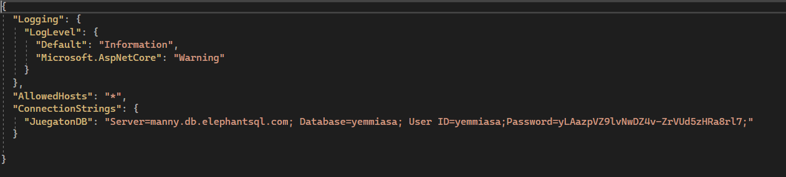
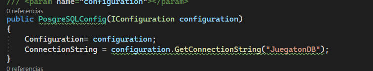

# JuegatonAPI
Este repositorio pertenece al Grupo 6 de DAMv1A del ITB, Curso 2022-2023, formado por [Agustin Garibotto](agustin.garibotto.7e6@itb.cat), [Olav Martos](olav.martos.7e4@itb.cat), [Yanick Garcia](yanick.garcia.7e6@itb.cat) y [Joan Aguayo](joan.aguayo.7e6@itb.cat).

Este repositorio pertenece al proyecto de fin de curso en el que tuvimos dos semanas para hacer el proyecto.

Para este proyecto teniamos que hacer tres cosas: una Base de datos, una API y una pagina web que se conecte a dicha API.

Este repositorio se trata de la API usada.

Se usa el swagger, un conjunto de herramientas de software para diseñar y construir servicios RESTful.

# Appsetting.json
El primer paso para lograr construir una API conectada a nuestra base de datos fue modificar este archivo de la api para lograr una conexión.

Simplemente teniamos que escribir la URL de nuestro servidor, la base de datos, el usuario y la contraseña para iniciar sesion, quedando de esta forma:

# PostgreSQLConfig.cs
Tuvimos que crear una carpeta llamada Models/ para poder administrar la conexión a la base de datos y el funcionamiento de las clases.

Donde unicamente le pusimos el nombre que escribimos antes de los dos y el nombre del server en el appsettings: JuegatonDB

# Clases
El siguiente paso fue crear distintas clases segun las tablas que teniamos en un principio que eran cuatro, pero de esas cuatro clases solo tres se han usado a lo largo del proyecto que es la de Jugador, Wordle y Ahorcado

La clase Leaderboard pensamos que la ibamos a usar pero hubieron cambios a la hora de crear la base de datos por lo que su tabla fue eliminada y su clase, repositorio y controlador han quedado inutiles.

En estas clases unicamente estan definidos los atributos que necesita cada tabla de la base de datos

# Repositorios
Los repositorios se podria decir que son la parte más importante de toda la API debido a que son las que contienen las instruccion de PostgreSQL para la base de datos.

Tenemos cuatro repositorios: Jugador, Wordle, Ahorcado y Leaderboard. Como dijimos, Leaderboard ha quedado inhabilitado por lo que no se hablara de él ni de su controlador.

Para los repositorios teniamos que pensar que datos ibamos a necesitar.

## Jugador Repository
En este repositorio se encuentran muchas instrucciones distintas:

1. Obtener todos los jugadores
2. Obtener un jugador especifico usando su clave primaria de la tabla
3. Insertar un jugador nuevo
4. Actualizar los datos de un jugador existente
5. Borrar un jugador
6. Actualizar unicamente la puntuacion de un jugador existente

## Wordle Repository y Ahorcado Repository
Estos dos repositorios son simples unicamente constan de una instruccion para obtener todos los datos de la tabla. Unicamente se guardan strings por lo que mucho problema no hay.

# Controladores
Los controladores son los metodos HTTP que tenemos para poder ejecutar los metodos que contienen cada repositorio

## Jugador Controller

Tiene dos metodos GET, que son los usados para obtener los jugadores o a un jugador especifico
Un metodo POST que se usa para insertar un jugador nuevo
Dos metodos PUT, que se usan para actualizar los datos de un jugador o actualizar solo la puntuacion de ese jugador.
Y un metodo DELETE que sirve para eliminar ese jugador de la base de datos